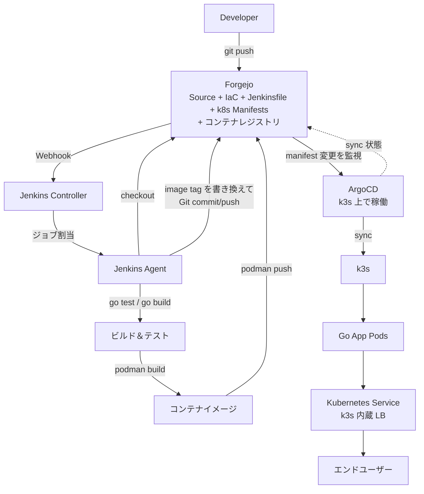
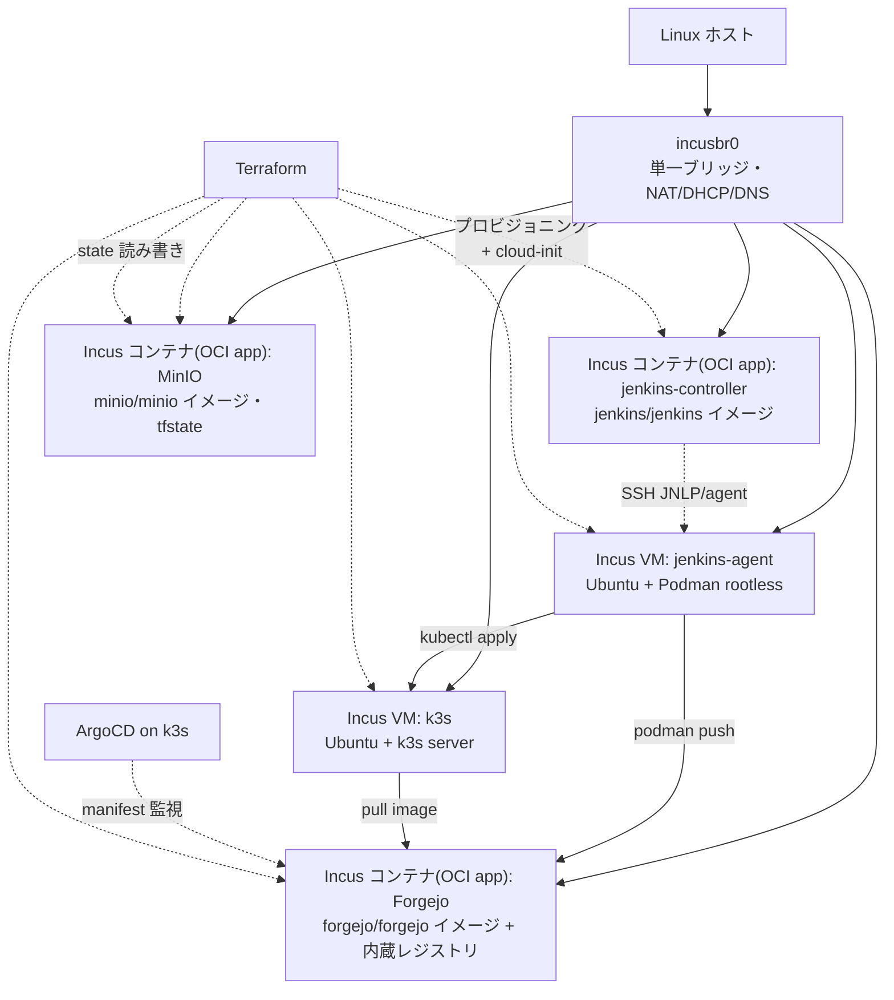
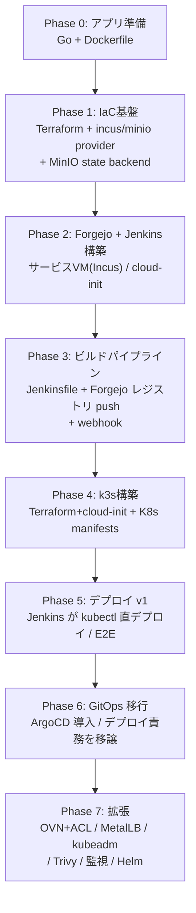
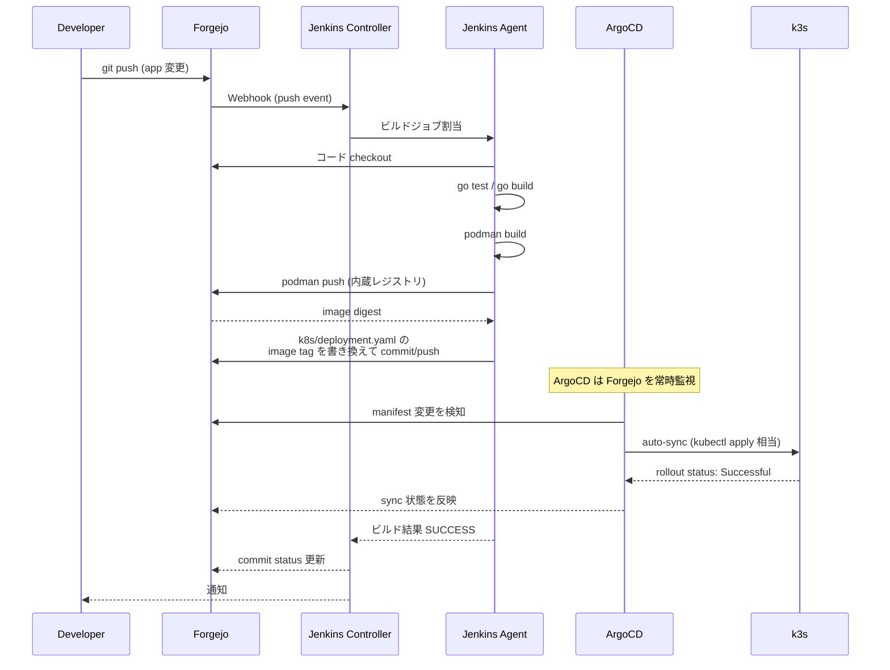

# Jenkins + ローカル環境 GitOps 学習ロードマップ(ローカル版)

> 本ファイルは `docs/plan.md`(Azure/AKS 版)のローカル実施版。Azure が使えない環境で同様の CI/CD + GitOps を学習するための構成・ロードマップ・原文との差分を定義する。
> 構成の理由・意図は `plan.md` を正とし、本ファイルは「ローカル版固有の置換と差分」に集約する(二重管理しない)。各 Phase の完了条件(DoD)も本ファイルでローカル版に差し替えて記載する。

---

## 1. 位置付けと前提

- **なぜローカル版か**: Azure が使えない環境で、同様の CI/CD + GitOps を学習するため、全要素をローカル(Incus)で再現する。
- **原文との関係**: `plan.md` は Azure 版の正文として残す。本ファイルはローカル版の正文。学習の脊柱(CI/CD + GitOps + 責務分離)は両版で共通。
- **環境前提**: KVM(ハードウェア仮想化)が有効な Linux ホスト上で Incus が VM/システムコンテナを起動できること。
- **主眼**: GitOps(ArgoCD)によるデプロイ責務分離。これから外れる沼候補は Phase 7 に回す。

---

## 2. 技術選定(ローカル版)

| 項目 | Azure版(plan.md) | ローカル版 | 理由 |
|---|---|---|---|
| アプリ | Go | Go | 変更不要 |
| コンテナ | Podman rootless | Podman rootless | 変更不要(Incus VM 内で動作) |
| IaC | Terraform + `azurerm` | Terraform + `incus`/`minio` provider | ワークフロー/HCL 構文は共通。provider は差し替え |
| Git ホスト | GitHub | **Forgejo**(Incus OCI app) | LAN 内で webhook が届く。コンテナレジストリ内蔵で ACR 代替も兼ねる |
| VM | Azure Linux VM x2 | **Incus コンテナ(OCI app)**(controller) + **Incus VM**(agent) | cloud-init 互換。実務転用可能な Incus スキルを磨く |
| Jenkins | Controller+Agent on VM | Controller(OCI app) + Agent(VM) on Incus | 構成そのまま |
| レジストリ | ACR | **Forgejo 内蔵レジストリ** | 部品数削減。OCI 互換で `podman push` 可能。スキャンは Phase 7(Trivy) |
| K8s | AKS(マネージド) | **k3s** on Incus VM | 軽量・実務実績あり・VM 上で動かし Incus 練習も回る |
| tfstate backend | Storage Account Blob | **MinIO**(Incus OCI app・S3 互換) + `use_lockfile` | リモート state + ロックの学習を保持。S3 API は転移性高い |
| 認証 | az login / SP / Managed Identity | SSH 鍵 + トークン | クラウド認証は喪失(第7章) |
| レジストリ認可 | AcrPull/AcrPush(MI+Role) | Jenkins Credential + ImagePullSecret | IaC 管理 IAM は喪失(第7章) |
| ネットワーク | VNet/Subnet/NSG | **単一フラットネット**(`incusbr0`) | 沼回避。セグメンテーションは Phase 7(OVN+ACL) |
| LB/公開IP | Azure LB + PublicIP 自動 | k3s 内蔵 LB(ServiceLB) | 単一ノードなら十分。MetalLB は Phase 7 |
| cloud-init | あり | あり(Incus ネイティブ) | 変更不要 |
| GitOps | ArgoCD | ArgoCD | 変更不要 |

> **Terraform の抽象化の限界**: Terraform が抽象化するのは「道具とワークフロー」であり「クラウドの能力表面」ではない。provider を替えるとリソースモデルごと替わるため、Azure 固有のリソース(Managed Identity / VNet / NSG / AKS 管理プレーン等)は Terraform を挟んでも再現できない。この点の損失は第7章に集約。

---

## 3. ターゲットアーキテクチャ(ローカル版: 最終形 ArgoCD GitOps)

### Incus トポロジ(Terraform プロビジョニング対象)

CI/CD フローとは別に、Incus 上のリソーストポロジを単位で可視化したもの。Terraform が何をプロビジョニングするかを示す。

> Jenkins controller / Forgejo / MinIO は配布イメージを Incus の OCI app コンテナで起動(cloud-init 不要)。Jenkins agent と k3s は VM を前提とする(Podman rootless と K8s カーネル機能の都合・最小 cloud-init)。全コンポーネントを Incus に集約し host Podman は併用しない(Incus↔host 間のフォワード設定を避けるため)。OCI app で不具合のあるイメージがあれば Incus VM + Podman に逃げる(host Podman には逃げない)。

### データ永続化(Incus インスタンス)

Incus で起動するステートフルなコンポーネントは、インスタンス再作成(Terraform 再 apply での replacement 等)でデータが消えないよう、**データを Incus ストレージボリューム(独立ディスク)に永続化**する。root disk に置いたデータはインスタンス作り直しで消える。

| コンポーネント | 永続化対象 | 形態 |
|---|---|---|
| Jenkins controller | `/var/lib/jenkins`(ジョブ・設定・クレデンシャル) | OCI app + ボリューム |
| Forgejo | リポジトリ・DB(`/data` 等) | OCI app + ボリューム |
| MinIO | オブジェクト・tfstate | OCI app + ボリューム |
| k3s | etcd データ(クラスタ状態) | VM + ボリューム |
| Jenkins agent | (無し・ephemeral で可) | VM |

原則: ステートフルデータは root disk にのみ置かない。Incus カスタムストレージボリュームをインスタンスにアタッチしデータパスにマウントする。ボリュームも Terraform(incus provider)で管理可能。

---

## 4. フェーズロードマップ(ローカル版)

---

## 5. 各フェーズ詳細と原文との差分

### Phase 0 — アプリ準備(Jenkins 未使用)
- **差分**: なし。純ローカル。
- **成果物**: ローカルで動く Go アプリ + Dockerfile + テスト(`app/main.go`, `app/main_test.go`, `app/go.mod`, `app/Dockerfile`)
- **✅ 完了条件(ローカル版)**: `plan.md` に同じ(`go test` PASS / `go run` で `/healthz` 200 / `podman build` 成功 / `podman run` で 200)

---

### Phase 1 — IaC基盤(Terraform 導入)
- **差分**: Storage Account → **MinIO**(Incus OCI app コンテナ)。`azurerm` → `incus`/`minio` provider。`az login` → 不要(ローカルソケット/トークン認証)。
- **成果物**: Incus の OCI app コンテナで MinIO が立つ、`terraform init/plan/apply` が通る、リモート state + ロックが効く。
- **bootstrap 順序(重要)**: MinIO 自身の state は MinIO に置けない(鶏卵)。小さな `bootstrap/` 構成(local state)で MinIO + bucket を作成した後、メインの `environments/dev/`(S3 backend)に進む二段構成にする。
- **学習ポイント**: state 管理の重要性、`terraform init/plan/apply` サイクル、リモート backend + ロック、bootstrap 順序問題
- **✅ 完了条件(ローカル版)**:
  - MinIO が Incus OCI app コンテナで起動
  - `terraform init`(S3 backend 指定)が成功
  - `terraform plan` がエラーなく表示
  - `terraform apply` で bucket/インスタンスが作成される
  - `use_lockfile` でロックが効く(二重 apply で lock エラーを確認)

---

### Phase 2 — Forgejo + Jenkins 構築(Controller + Agent)
- **差分**: Azure VM → **Incus コンテナ(OCI app)**(Forgejo・Jenkins controller) + **Incus VM**(Jenkins agent)。NSG/公開IP は無し(単一フラットネット)。SSH launcher はそのまま。controller/Forgejo は配布イメージそのまま(cloud-init 不要)、agent は VM + 最小 cloud-init(Podman インストール)。**Forgejo は原文には無い新規プロビジョニング対象**(原文は GitHub 既存)。Phase 0/1 のコードはローカル git で進め、この Phase で Forgejo が立った後にリポジトリへ push する。
- **成果物**: Incus 上で Forgejo と Jenkins が動き、Jenkins Agent 経由でジョブが実行できる。
- **学習ポイント**: Jenkins 内部構造、Controller/Agent 分離の意義、Incus での OCI app 起動(controller/Forgejo)と VM プロビジョニング(agent・最小 cloud-init)の使い分け、Forgejo 内蔵レジストリ設定
- **✅ 完了条件(ローカル版)**:
  - `terraform apply`(incus provider) で Incus コンテナ(OCI app)(Forgejo + Jenkins controller) + Incus VM(Jenkins agent)が作成される
  - ブラウザから Forgejo UI にアクセス可能、リポジトリ作成と git push/pull ができる
  - Forgejo 内蔵レジストリが有効(Phase 3 で使用)
  - ブラウザから Jenkins UI にアクセス可能(初期パスワードでログイン)
  - Agent ノードが Jenkins UI 上で「オンライン」表示
  - サンプル freestyle ジョブで Agent 上の `whoami`/`uname` が実行できる

---

### Phase 3 — ビルドパイプライン
- **差分**: ACR → **Forgejo 内蔵レジストリ**(Forgejo 本体は Phase 2 で構築済み)。GitHub webhook → **Forgejo webhook**。ACR 認証(MI) → Forgejo トークン(Jenkins Credentials に格納)。
- **成果物**: push トリガでビルド→テスト→Forgejo レジストリ プッシュまで自動化。
- **学習ポイント**: Pipeline as Code、Credentials 管理、Webhook 連携、Podman rootless ビルドとレジストリ プッシュ
- **✅ 完了条件(ローカル版)**:
  - Forgejo に push すると Webhook で Jenkins ジョブが起動
  - コンソールログで `go test` PASS / `podman build` 成功
  - Forgejo レジストリにイメージがプッシュされる(UI または `podman search` で確認)

---

### Phase 4 — K8s 構築(k3s)
- **差分**: AKS(マネージド) → **k3s on Incus VM(セルフ管理・最小 cloud-init)**。`az aks get-credentials` → k3s VM から kubeconfig を取得。ACR↔AKS 統合(MI+AcrPull) → **ImagePullSecret**(Forgejo レジストリのトークン)。Service LB → **k3s 内蔵 LB(ServiceLB)**。
- **喪失**: マネージド K8s プロビジョニング(SKU/ノードプール/アップグレードチャネル)、Managed Identity + Role による IaC-IAM(第7章)。
- **成果物**: k3s クラスタが立ち上がり、`kubectl` で操作できる。
- **学習ポイント**: Deployment/Service/Pod の実体、`kubectl` 操作、Terraform+cloud-init での K8s 構築、ImagePullSecret によるレジストリ認証
- **✅ 完了条件(ローカル版)**:
  - Terraform+cloud-init で k3s VM が起動し k3s が入る
  - `kubectl get nodes` でノードが Ready
  - 手動で `kubectl apply -f k8s/` → Pod が Running
  - Service のノードIP に curl で `/healthz` 200 OK(※この時点では手動デプロイで完結)

---

### Phase 5 — デプロイ v1(kubectl 直デプロイ)
- **差分**: なし(概念的に同じ)。kubeconfig を Jenkins Credentials(Secret file)で管理する点も同じ。デプロイ先が AKS から k3s に変わるのみ。
- **成果物**: コミット→ビルド→プッシュ→デプロイ→`/healthz` アクセス確認まで E2E。
- **学習ポイント**: K8s ローリングアップデート、デプロイ戦略の基礎、シークレット管理、Jenkins と K8s の連携の課題(Phase 6 の動機)
- **✅ 完了条件(ローカル版)**:
  - Forgejo push → Jenkins ビルド → レジストリ push → kubectl デプロイ が E2E で完結
  - 新コミットで Pod がローリングアップデートされる
  - `kubectl rollout status` が SUCCESS

---

### Phase 6 — GitOps 移行(ArgoCD 導入・必須)
- **差分**: なし。ArgoCD を k3s 上に Helm で入れる。マニフェスト監視元が GitHub から Forgejo に変わるのみ。
- **成果物**: Jenkins はビルドまで、デプロイは ArgoCD が Forgejo を監視して自動同期。
- **学習ポイント**: GitOps パラダイム、Single Source of Truth、Jenkins(CI) と ArgoCD(CD) の責務分離、ドリフト検出、ロールバックの容易さ
- **✅ 完了条件(ローカル版)**:
  - ArgoCD UI で Application が Healthy/Synced 表示
  - Jenkinsfile の deploy stage を削除、manifest tag 書き換え push に置換
  - push → ビルド → レジストリ push → manifest 更新 → ArgoCD 自動 sync → k3s 反映 が E2E
  - `git revert` でロールバックできることを確認

---

### Phase 7 — 拡張(沼候補・任意)
本筋(GitOps)から外れる深掘り。優先順位は都度決める。

- **ネットワークセグメンテーション**: Incus OVN ネットワーク + `network acl`(Azure NSG のアナログ)。生 nftables は避けツール管理に任せる。
- **MetalLB(L2/BGP)**: k3s 内蔵 LB を置き換え、IP プールからの仮想 IP 払い出しを体験。
- **kubeadm / Talos**: K8s 内部の深掘り(本プロジェクトの本題からは脱線)。
- **Trivy**: イメージ脆弱性スキャン(Forgejo レジストリに別乗せ)。
- **Harbor**: レジストリ深掘り(RBAC/レプリケーション/スキャン)。Forgejo から載せ替え。
- **Ingress + cert-manager** で HTTPS。
- **監視**: Prometheus/Grafana。
- **Jenkins Agent のコンテナベース化・ephemeral 化**。
- **Jenkins 自体を k3s 上で稼働**(Helm chart)。

---

## 6. CI/CD シーケンス(ローカル版: 最終形 ArgoCD GitOps)

---

## 7. ローカル版で失う学習 / 増える学習

### 失う(Azure 固有・ローカル非依存)
- **マネージド K8s(AKS)プロビジョニング** — control plane管理、ノードプールSKU、アップグレードチャネル
- **Managed Identity + Role Assignment(AcrPull/AcrPush)** — IaC で IAM を管理するパターン(**最大損失**)。ローカルは静的クレデンシャルに後退
- **Azure 認証フロー** — az login / Service Principal / subscription スコープ
- **Azure ネットワークモデル** — VNet/Subnet/NSG/peering(Phase 7 の OVN+ACL で一般 FW スキルは補えるが、Azure 固有モデルは消える)
- **クラウド LB の自動 IP 払い出しフロー**(Phase 7 の MetalLB は別概念)
- **ACR 固有機能** — geo-replication / content trust / SKU 階層
- **コスト管理** — `plan.md` 第9章。ローカルでは電気代以外無意味
- **リージョン/可用性ゾーン** 概念

### 増える(ローカル固有)
- **セルフ管理 K8s の中身** — etcd/kubelet/control plane が見える
- **Incus VM/システムコンテナの運用** — 実務転用可能
- **MinIO(S3 API)の運用** — AWS S3 等に知識転移
- **Linux 層 FW の手触り** — Phase 7 の OVN+ACL 経由(汎用スキル)
- **反復が速い・無料・レートリミット無し** — 失敗し放題で学習効率が上がる

---

## 8. 事前検証チェックリスト(着手前に確認)

- [x] KVM 有効、Incus VM が起動しホストから IP 到達できる
- [ ] Incus ≥6.3 であること(OCI app モード使用・6.0 LTS は不可)
- [ ] Incus OCI app で `jenkins/jenkins`・`forgejo/forgejo`・`minio/minio` イメージが起動できる
- [ ] Incus VM 内で Podman rootless がビルドできる(`pasta`/`subuid`/`subgid` 設定)
- [ ] Terraform `incus` provider がインスタンス起動 + cloud-init を扱える(未成熟なら `null_resource` + `local-exec` で CLI 呼び出しに退避)
- [ ] MinIO 起動 + `backend "s3"` + `use_lockfile` でロックが効く(要: 最近の Terraform/MinIO)
- [ ] Forgejo 起動 + 内蔵レジストリへ `podman push` できる
- [ ] ホストのプロキシ/egress 制約がイメージ取得/pull に影響しない

---

## 9. 原文リソース対応表

| Azure リソース(plan.md) | ローカル対応 | Terraform 管理可否 |
|---|---|:---:|
| Resource Group | (該当なし・Incus プロジェクトで代替) | — |
| Storage Account(tfstate) | MinIO(Incus OCI app) | ✅ |
| VNet + Subnet x2 | 単一 `incusbr0`(分離は Phase 7 OVN) | △ |
| NSG x2 | (無し・Phase 7 で OVN+ACL) | — |
| Public IP | (無し・ノードIP で直接) | — |
| VM x2(controller/agent) | Incus コンテナ(OCI app)(controller) + Incus VM(agent, cloud-init) | ✅ |
| ACR | Forgejo 内蔵レジストリ(Incus OCI app) | △(Forgejo 自体は TF 管理、レジストリ設定は手動/CLI) |
| AKS | k3s on Incus VM | ✅(VM は TF、k3s インストールは cloud-init) |
| Managed Identity + Role | (無し・静的クレデンシャル) | ✕ 喪失 |
| ArgoCD / App Pod / Service | 同左 | ❌(ArgoCD/manifest 管理、Terraform 対象外) |
