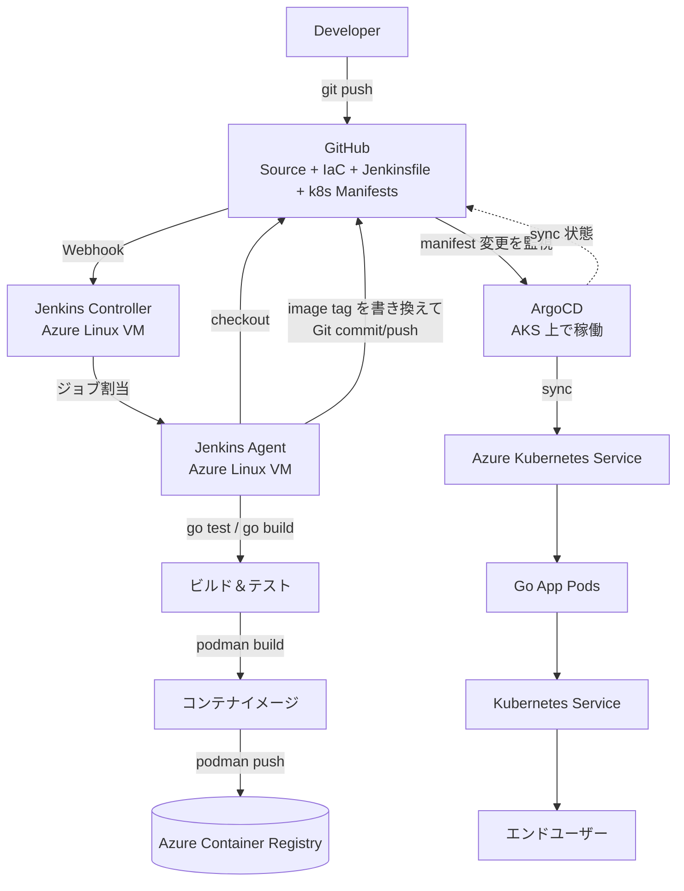
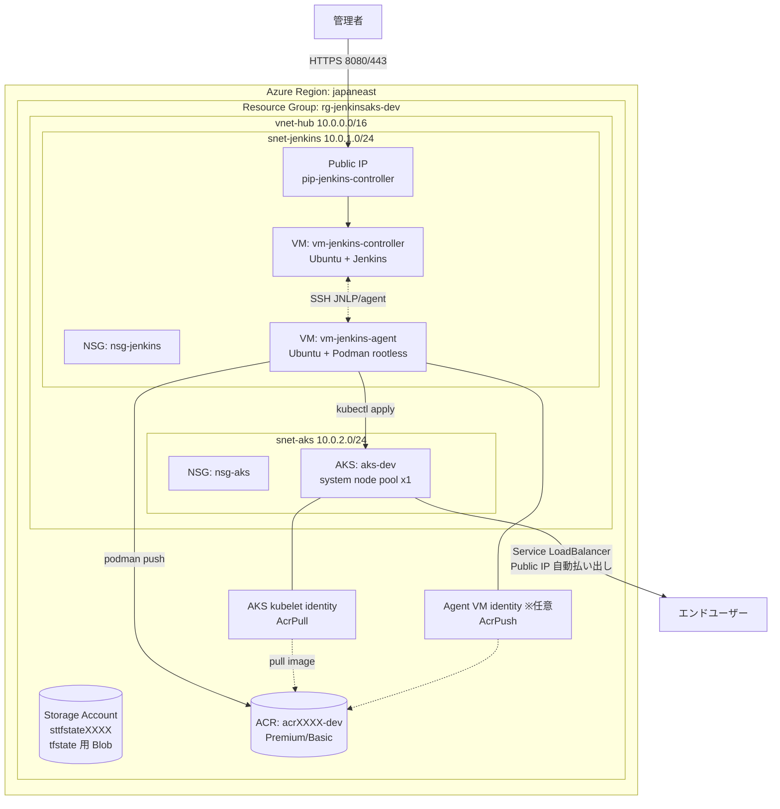
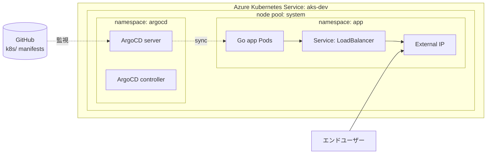
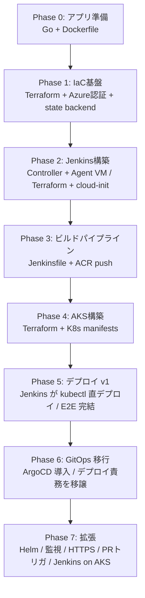
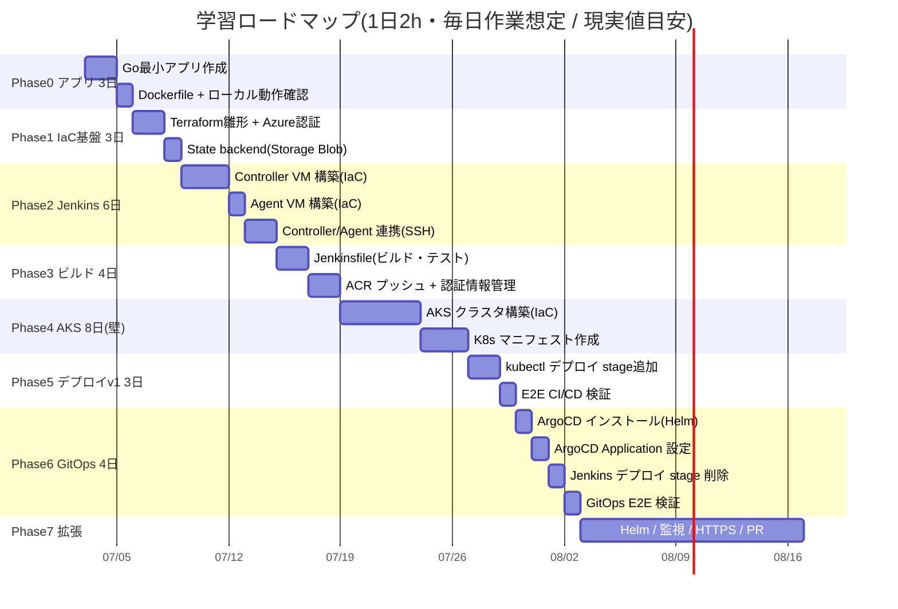
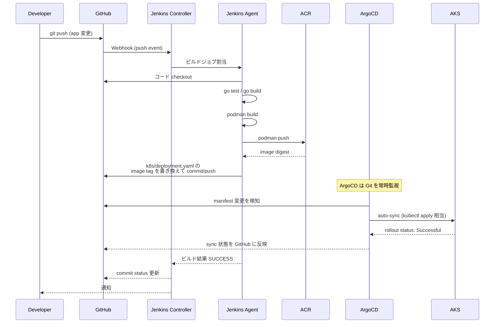

# Jenkins + Azure AKS + ArgoCD 学習ロードマップ

> GitHub + Jenkins + Azure + Kubernetes + Terraform + ArgoCD を用いた CI/CD 構築の学習計画

---

## 1. 目的と想定読者

### 目的
- Jenkins / Azure / Kubernetes(AKS) を段階的に習得するための自己学習として、CI/CD 構築を進める
- GitHub + Jenkins + Azure + AKS を使った簡単な CI/CD を構築し、各ツールの扱いに慣れる
- 最終的には **Terraform による IaC** と **ArgoCD による GitOps デプロイ** を組み込んだ実務寄りの構成を目指す

### 想定読者と事前スキル
本ロードマップは、以下のような事前スキルを持つ学習者を想定している。

| 領域 | 想定される事前レベル |
|---|---|
| 何らかの CI/CD ツール(GitHub Actions 等)の構築・運用 | 実務経験あり |
| Linux サーバ運用 | 実務経験あり |
| Jenkins | UI 経験のみ、または未経験 |
| Azure | 基礎知識あり(資格や座学程度)、実務経験はなし〜薄い |
| Kubernetes | 初学〜数日程度の学習のみ、習得意欲あり |

### 学習戦略
- **既存の強みを即活かす**：Linux 運用スキル → Jenkins Controller/Agent VM 構築・運用、既存 CI/CD ツールの知識 → Jenkinsfile(Pipeline as Code) の対比学習
- **座学知識を手で補強**：Azure の基礎知識を Terraform で実際にリソース構築しながら定着
- **段階的に積み上げ(動作保証型)**：依存関係順にフェーズ分割し、各フェーズは「その時点で完結して動作する」状態を完了条件(DoD)として保証する。各フェーズは前段を土台に拡張していく形で、どこで止めても動く系が残る

---

## 2. 技術選定と理由

| 項目 | 選定 | 理由 |
|---|---|---|
| アプリ | Go(最小HTTPサーバ) | ビルドが速く、コンテナ化しやすい。アプリの中身は本題ではない |
| IaC | **Terraform**(必須) | HCL は宣言型で CI/CD ツールの YAML 経験者に馴染みやすく、Azure 以外でも転用可能。Bicep より学習資産が残る |
| コンテナツール | **Podman**(rootless・daemonless) | Docker 互換で Dockerfile をそのまま使用可。デーモン不要・rootless がデフォルトでセキュア。K8s と同じ OCI ランタイム系で親和性高い |
| コンテナレジストリ | Azure Container Registry (ACR) | AKS と統合しやすく、マネージドID 連携可能 |
| Jenkins 配置 | Azure Linux VM 上に Controller + Agent | 実務で多い構成。Linux 運用スキルが即活きる。AKS 上 Jenkins は鶏卵問題を避けるため Phase 7 拡張ネタに回す |
| デプロイ方式 | **Phase 5: kubectl 直デプロイ** → **Phase 6: ArgoCD(GitOps)** | まず K8s デプロイの基本を体験し、その後 GitOps へ移行するのが学習効果最大化 |
| GitOps ツール | **ArgoCD**(必須) | デプロイ責務を Jenkins から分離し、Git を唯一の真の情報源(Single Source of Truth) にする |

---

## 3. ターゲットアーキテクチャ(最終形：ArgoCD GitOps 版)



### 責務分離(ここが最重要)
- **Jenkins** = CI(ビルド・テスト・イメージプッシュ・マニフェストの tag 書き換え)
- **ArgoCD** = CD(Git のマニフェストを AKS に同期)
- **Terraform** = インフラプロビジョニング(VM, AKS, ACR, ネットワーク等)
- **Git** = Single Source of Truth(ソース、IaC、Jenkinsfile、K8sマニフェストすべて管理)

### Azure リソース構成視点(Terraform 管理対象)

CICD フローとは別に、Azure リソースのトポロジをリソース単位で可視化したもの。Terraform が何をプロビジョニングするかを示す。



#### リソースと Terraform 管理の対応

| リソース | 役割 | Terraform管理 |
|---|---|:---:|
| Resource Group | 全リソースを1つに集約(学習用) | ✅ |
| Storage Account | tfstate 用 Blob backend | ✅ |
| VNet + Subnet x2 | Jenkins系 / AKS系を分離 | ✅ |
| NSG x2 | サブネット単位の通信制御 | ✅ |
| Public IP | Controller UI 用(AKS LBのIPは動的払い出し) | ✅ Controller分のみ |
| VM x2 | Controller(Jenkins) / Agent(Podman) | ✅ + cloud-init |
| ACR | コンテナイメージ保管 | ✅ |
| AKS | K8s クラスタ + ノードプール | ✅ |
| Managed Identity + Role | AKS→ACR pull / Agent→ACR push | ✅ |
| ArgoCD / App Pod / Service | K8s アプリ層 | ❌(ArgoCD/manifest管理、Terraform対象外) |

#### 構成のポイント
- **ネットワーク分離**：Jenkins系とAKS系をサブネットで分け、実務構成に寄せている。学習用なら同一サブネットでも動くが、NSGの練習も兼ねて分離を推奨
- **ACR アクセス**：AKS は kubelet identity + `AcrPull` で pull。Agent は任意で VM identity + `AcrPush` を付与(学習段階では `podman login` + トークンでも可)
- **AKS Service LB**：`Service type=LoadBalancer` が AKS に Public IP を動的払い出しさせる。Terraform 管理外だが AKS 経由で作成されるリソース

### AKS クラスタ内部構成視点

ArgoCD 導入後(Phase 6 以降)の AKS 内部。Phase 4〜5 では namespace:app のみ。



---

## 4. Terraform と ArgoCD の適用範囲

### Terraform が管理するもの(インフラ層)
- リソースグループ
- Storage Account(tfstate backend 用)
- Virtual Network / Subnet / NSG
- Public IP / Network Interface
- Jenkins Controller VM / Agent VM(cloud-init で初期化)
- Azure Container Registry (ACR)
- Azure Kubernetes Service (AKS) クラスタ
- ACR ↔ AKS のロール割当(AcrPull)

### Terraform が管理「しない」もの(K8s アプリ層)
- K8s マニフェスト(Deployment / Service / Ingress 等)
- ArgoCD 本体のインストール
- ArgoCD Application CRD

> K8s リソースを Terraform で管理するのはアンチパターン(ArgoCD と競合する)。K8s アプリ層は **素のYAML / Helm / Kustomize + ArgoCD** で管理する。この責務分離自体が実務構成。

### ArgoCD が管理するもの
- `k8s/` ディレクトリのマニフェストを監視
- イメージタグ書き換えを検知して自動同期(auto-sync)
- デプロイ状態の可視化とドリフト検出

---

## 5. フェーズロードマップ





---

## 6. 各フェーズ詳細

### Phase 0 — アプリ準備(Jenkins 未使用)
**成果物**：ローカルで動く Go アプリ + Dockerfile + テスト

- `app/main.go`：`/healthz` を返すだけのHTTPサーバ(ポート8080)
- `app/main_test.go`：`healthzHandler` のテスト(`httptest` 使用)
- `app/go.mod`、`app/Dockerfile`(マルチステージビルド)
- ローカルで `go test` / `go run` / `podman build` / `podman run` で動作確認

**学習ポイント**：Go 最小構成、`httptest` によるハンドラテスト、マルチステージ Dockerfile、イメージサイズ最適化、Podman による rootless ビルド

**✅ 完了条件(この時点で動作することが保証される状態)**：
- `go test ./...` が成功(テストが通る)
- `go run main.go` → `curl localhost:8080/healthz` が 200 OK
- `podman build -t go-app .` が成功
- `podman run -p 8080:8080 go-app` → curl で 200 OK

---

### Phase 1 — IaC基盤(Terraform 導入)
**成果物**：Azure に tfstate 用 Storage ができる、`terraform plan/apply` が通る

- Terraform 雛形作成、`az login` によるローカル認証
- リソースグループ、Storage Account(tfstate backend 用)
- `backend.tf` でリモート state 設定

**学習ポイント**：Azure の座学知識を手で補強、state 管理の重要性、`terraform init/plan/apply` サイクル

**✅ 完了条件**：
- `az login` → `terraform init`(backend 指定)が成功
- `terraform plan` がエラーなく表示
- `terraform apply` で Storage Account が作成される(ポータルで確認)

---

### Phase 2 — Jenkins 構築(Controller + Agent)
**成果物**：VM 上で Jenkins が動き、Agent 経由でジョブが実行できる

- Terraform で Ubuntu VM x2 を作成(controller / agent)
- cloud-init で Jenkins インストール自動化
- Controller から Agent へ **SSH launcher** で接続(Linux スキル活用)
- NSG / SSH 鍵管理も Terraform で

**学習ポイント**：Jenkins 内部構造、Controller/Agent 分離の意義、cloud-init、IaC での VM プロビジョニング

**✅ 完了条件**：
- `terraform apply` で VM x2 が作成される
- ブラウザから Jenkins UI にアクセス可能(初期パスワードでログイン)
- Agent ノードが Jenkins UI 上で「オンライン」表示
- サンプル freestyle ジョブで Agent 上の `whoami`/`uname` が実行できる

---

### Phase 3 — ビルドパイプライン
**成果物**：push トリガでビルド→テスト→ACR プッシュまで自動化

- `Jenkinsfile`(Declarative)作成：checkout → `go test` → `go build` → `podman build` → `podman push` to ACR
- ACR 認証情報を Jenkins Credentials に格納
- GitHub Webhook → Jenkins push trigger 設定

**学習ポイント**：Pipeline as Code(既存 CI/CD ツールとの対比で理解が深まる)、Credentials 管理、Webhook 連携、Podman rootless ビルドと ACR プッシュ

**✅ 完了条件**：
- GitHub に push すると Webhook で Jenkins ジョブが起動
- コンソールログで `go test` PASS / `podman build` 成功
- ACR にイメージがプッシュされる(`az acr repository list` で確認)

---

### Phase 4 — AKS 構築
**成果物**：AKS クラスタが立ち上がり、`kubectl` で操作できる

- Terraform で AKS クラスタ作成(小規模SKU、1ノード、学習用)
- ACR と AKS の統合(`AcrPull` ロール割当、Terraform で管理)
- `k8s/deployment.yaml`、`k8s/service.yaml`(LoadBalancer or ClusterIP+Ingress)

**学習ポイント**：Deployment/Service/Pod の実体、`kubectl` 操作、AKS と ACR の連携、Terraform でのマネージドK8s構築

**✅ 完了条件**：
- `terraform apply` で AKS クラスタが作成される
- `az aks get-credentials` でローカル kubeconfig が設定される
- `kubectl get nodes` でノードが Ready
- 手動で `kubectl apply -f k8s/` → Pod が Running
- Service の External IP に curl で `/healthz` 200 OK(※この時点では手動デプロイで完結)

---

### Phase 5 — デプロイ v1(kubectl 直デプロイ)
**成果物**：コミット→ビルド→プッシュ→デプロイ→`/healthz` アクセス確認まで E2E

- Jenkinsfile に `deploy` stage 追加：`kubectl apply` / `kubectl rollout status`
- kubeconfig を Jenkins Credentials(Secret file)で管理
- **ここではあえて Jenkins にデプロイも任せる**(K8s デプロイの基本を体験)

**学習ポイント**：K8s ローリングアップデート、デプロイ戦略の基礎、シークレット管理、Jenkins と K8s の連携の課題(これが Phase 6 の動機になる)

**✅ 完了条件**：
- GitHub push → Jenkins ビルド → ACR push → kubectl デプロイ が E2E で完結
- 新コミットで Pod がローリングアップデートされる
- `kubectl rollout status` が SUCCESS

---

### Phase 6 — GitOps 移行(ArgoCD 導入・必須)
**成果物**：Jenkins はビルドまで、デプロイは ArgoCD が Git を監視して自動同期

- ArgoCD を AKS 上に Helm でインストール
- ArgoCD Application CRD で `k8s/` ディレクトリを監視対象に設定
- Jenkinsfile の `deploy` stage を **削除** し、代わりに「マニフェストの image tag を書き換えて Git push」する stage を追加
- ArgoCD が Git の変更を検知して auto-sync
- E2E 検証：push → ビルド → ACR push → manifest 更新 → ArgoCD sync → AKS に反映

**学習ポイント**：GitOps パラダイム、Single Source of Truth、Jenkins(CI) と ArgoCD(CD) の責務分離、ドリフト検出、ロールバックの容易さ(Git revert だけで元に戻る)

**✅ 完了条件**：
- ArgoCD UI で Application が Healthy/Synced 表示
- Jenkinsfile の deploy stage を削除、manifest tag 書き換え push に置換
- push → ビルド → ACR push → manifest 更新 → ArgoCD 自動 sync → AKS 反映 が E2E
- `git revert` でロールバックできることを確認

---

### Phase 7 — 拡張(任意・深掘り)
- Helm 化 / Kustomize 導入
- Ingress + cert-manager で HTTPS
- 監視(Prometheus/Grafana または Azure Monitor)
- Jenkins Multibranch Pipeline で PR トリガ
- Jenkins Agent をコンテナベース・ephemeral 化
- Jenkins 自体を AKS 上で稼働(Helm chart)
- Terraform Cloud / Atlantis で IaC の PR ベース運用

---

## 7. CI/CD シーケンス(完成形：ArgoCD GitOps 版)



---

## 8. リポジトリ構成案(学習用・単一リポジトリ)

```
jenkins-gitops-k8s/
├── app/                         # Go アプリ
│   ├── main.go                  # エントリポイント(最小)
│   ├── main_test.go             # テストは対象と同ディレクトリに並置(Go 慣習)
│   ├── go.mod
│   ├── go.sum                   # 外部依存を入れた場合のみ
│   └── Dockerfile
├── iac/                         # Terraform
│   ├── modules/
│   │   ├── jenkins-vm/
│   │   ├── aks/
│   │   └── acr/
│   ├── environments/
│   │   └── dev/
│   │       ├── main.tf
│   │       ├── backend.tf
│   │       └── terraform.tfvars   # gitignore 対象
│   └── cloud-init/
│       ├── controller.yml
│       └── agent.yml
├── k8s/                         # Kubernetes マニフェスト (ArgoCD 監視対象)
│   ├── deployment.yaml
│   ├── service.yaml
│   └── argocd/
│       └── application.yaml       # ArgoCD Application CRD
├── jenkins/
│   ├── Jenkinsfile
│   └── README.md
├── docs/
│   └── plan.md                    # 本ドキュメント
├── .gitignore
└── README.md
```

> 学習段階では単一リポジトリで十分。Phase 7 で app / infra リポジトリ分離の演習も可能。

---

## 9. コスト・運用上の注意点

- **Azure 費用発生**：VM / AKS / ACR は従量課金。学習時は小 SKU(`Standard_B2s` 程度)を使用
- **使わない時は `terraform destroy` または VM 停止**で節約。AKS は停止 API も可だが、学習用途なら destroy 再作成を前提に IaC を組む(＝IaC の練習にもなる)
- **本番構成との差**：学習用はノード1・HTTPS無し・監視無しで OK。Phase 7 で段階的に本番寄せ
- **秘密情報**：ACR 資格・kubeconfig・SSH 鍵・Service Principal 秘密鍵は Git に絶対入れない
  - Jenkins Credentials と Terraform 変数(`*.tfvars` は gitignore)で管理
- **Podman 固有の注意**：
  - rootless がデフォルト。Jenkins Agent ユーザで `podman build/push` を実行するため `subuid/subgid` 設定が必要(cloud-init で対応)
  - ACR へのプッシュは `podman login <acr-login-server>` で認証
  - Dockerfile は Docker と互換だが、デーモンがないため `DOCKER_HOST` 系の前提は無し
  - Podman 4.x 以降を推奨(OCI 互換性と安定性)

---

## 10. AI活用方針

本学習は「ツールの扱いに慣れる」ことが目的であり、AIに実装を丸投げすると学習効果が落ける。以下の線引きを厳守し、特に **コーチングによる対話** を中心に AI を活用する。

### やらせてよいこと(実装委譲OK)

学習価値が低く、概念を理解すれば二度とゼロから書かなくてよいもの。ここは AI に任せて時間を節約する。

| 対象 | 理由 |
|---|---|
| リポジトリ雛形・ディレクトリ構成 | 構造は覚えるものでない |
| Dockerfile のテンプレート | マルチステージの型は一度理解すれば使い回し |
| Terraform のボイラープレート(provider/backend 設定) | 毎回書く定型 |
| NSG ルール等の反復コード | 概念理解後はコピペ領域 |
| Go アプリの中身(`/healthz`) | 本題ではないと自分で宣言済み |
| テストコード | 学習の主眼ではない |
| エラー時のデバッグ補助 | 詰まった時の時間短縮は正当 |

### やらせてはいけないこと(必ず自分で書く)

ここを AI に書かせると学習が崩壊する。手で書いて初めて身につくもの。

| 対象 | 理由 |
|---|---|
| 最初の Jenkinsfile | 既存 CI/CD ツールとの対比で手で書くからこそ Jenkins の仕組みが身につく |
| 最初の K8s マニフェスト(Deployment/Service) | K8s の概念は YAML を書いて初めて理解できる。AI 丸投げ＝K8s 未経験のまま |
| 最初の Terraform リソース定義(VM/AKS) | IaC の思考法は手で書いて身につく |
| アーキテクチャ判断(LoadBalancer vs ClusterIP 等) | 判断を AI に委ねると「なぜそうしたか」が説明できなくなる |
| トラブルシュートの原因追究 | AI の提案を鵜呑みにせず、自分で仮説を立てる |

### コーチング活用法(本命・対話重視)

本学習の中核はここにある。「答えを渡す」ではなく「問いを返す」モードで AI を使い、理解に誠実に向き合う。

#### 基本姿勢：答えを渡さず、問いを返す

```
× NG: "Jenkinsfile 書いて"

◯ OK: "Jenkinsfile を自分で書きたい。
       既存 CI/CD ツール(GitHub Actions 等)の定義ファイルはこう書いてた(貼付)。
       Jenkins の Declarative Pipeline で同等のことを書くには
       どう構成すべきか、要点だけ教えて。コードは自分で書く"
```

#### 推奨するコーチングプロトコル(各 Phase ごとに回す)

1. **事前ブリーフ**：Phase 着手前に AI に「この Phase で学ぶべきこと 3 つ」「よくハマる落とし穴 5 つ」を聞く(実装は聞かない)
2. **手元実装**：自分で書く。AI は横で構文チェックのみ
3. **事後レビュー**：書いたものを AI に見せて「改善点」「実務で気をつけること」を聞く
4. **理解度チェック**：Phase 完了時に AI に「私の書いたコードを元に、なぜこのリソースをこう定義したか説明して」と聞き、自分の説明と AI の解釈が一致するか確認

#### 対話で深める問いの例

- 「このリソースをこう定義したが、実務ではどう違ってくる？」
- 「私の理解では XXX だが、これで合っている？ 間違っていれば指摘して」
- 「既存 CI/CD ツールでは YYY で実現していたが、Jenkins ではどう違う？」
- 「このエラーが出た。私の仮説は ZZZ。この仮説の妥当性を検証して。答えは言わないで」
- 「Phase 4 が終わった。K8s について自分が理解したことを 3 つ説明するので、抜け漏れがあれば指摘して」

#### AI の限界への自覚(コーチの言葉を鵜呑みにしない)

- **Azure の実環境は見えない**：AI が書いた Terraform が実際に apply 通るかは、自分の環境でしか検証できない。AI の出力は「たぶん動く」であって「確実に動く」ではない
- **知識にカットオフがある**：Podman 4.x/5.x の件のように、最新の細かい挙動は推測混じり。Azure/AKS の最新機能も同様。気になる場合は公式ドキュメントを併用
- **エラー解釈は強いが、環境固有の問題は弱い**：NSG/権限/IAM 系のハマりどころは現場でしか分からない
- **「動いた」を検証できない**：AI が「これで動く」と言っても、自分が `terraform apply` して確認するまで信用しない
